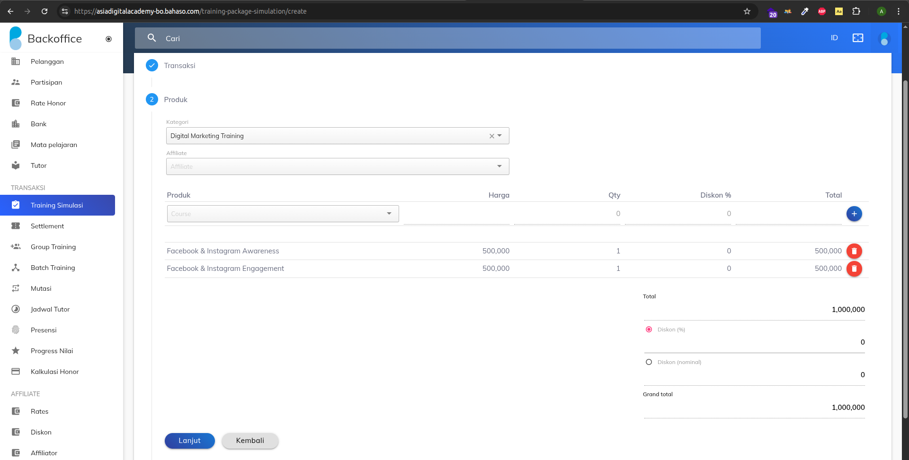
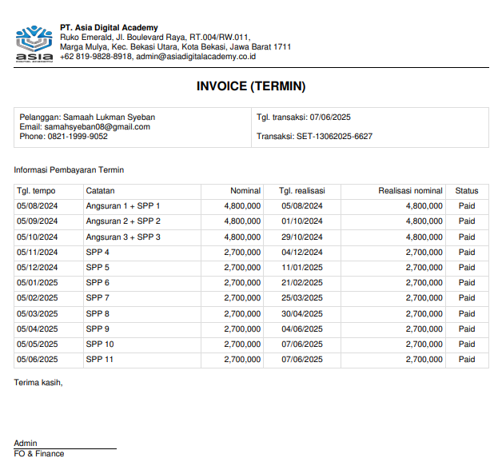
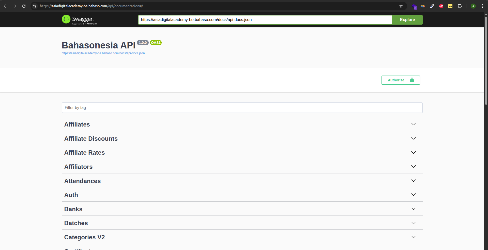

import Image from 'astro:assets'

#### 🧾 Deskripsi Proyek

**ADA Dashboard** adalah sistem internal (backoffice) yang dikembangkan untuk **Asia Digital Academy**, berfungsi untuk mengelola:

- Simulasi transaksi pelatihan (Training Simulation)
- Invoice sistem cicilan termin
- Integrasi API internal
- Monitoring peserta, tutor, dan pembayaran

Proyek ini digunakan oleh tim operasional untuk mendukung proses bisnis pelatihan digital bersertifikat.

---

#### 🔧 Fitur Utama

- 🎓 **Training Simulation**
  - Memilih kategori pelatihan
  - Menambahkan produk
  - Perhitungan diskon dan grand total otomatis

- 📄 **Invoice Termin**
  - Otomatisasi pembuatan invoice dengan termin cicilan bulanan
  - Realisasi pembayaran dan status pelunasan
  - Export PDF terstruktur

- 🔌 **API Integrasi (Swagger)**
  - Backend terhubung dengan sistem API dokumentasi Swagger
  - CRUD untuk data pelatihan, peserta, tutor, dan transaksi
  - Auth dan Role-based Access Control

---

#### 🧑‍💻 Teknologi yang Digunakan

- **Frontend:** Laravel + Livewire
- **Backend:** Laravel + Moodle
- **Database:** Mysql
- **PDF Generator:** HTML → PDF backend rendering
- **API Documentation:** Swagger UI

---

### 🖼️ Tampilan Antarmuka

#### 1. Simulasi Transaksi

#### 2. Invoice Termin

#### 3. API Dokumentasi Swagger

---

#### 📌 Hasil & Dampak

✅ Mempermudah tim finance dalam pelacakan pembayaran termin  
✅ Mengurangi error input manual dari admin  
✅ Meningkatkan transparansi antara bagian operasional dan manajemen
